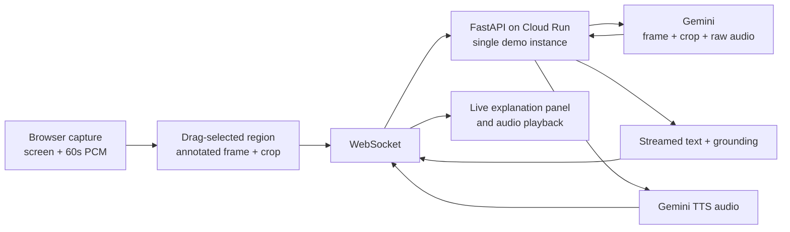

# Glance

**Point at any part of your shared screen and get an explanation grounded in
the last 60 seconds of conversation.** Existing meeting AI listens; Glance
looks at what you are pointing at, and listens.


## Architecture



The browser captures the user's own screen and microphone. It does not join or
integrate with Meet, Zoom, or Teams.

## Quickstart

Prerequisites: Node.js 20+, Python 3.11, and two terminal windows. The default
configuration is fully local and keeps AI disabled.

```bash
git clone <repo-url> glance && cd glance
cp .env.example .env
python3.11 -m venv backend/.venv && backend/.venv/bin/pip install -r backend/requirements.txt && npm --prefix frontend install
(cd backend && set -a && source ../.env && set +a && .venv/bin/uvicorn main:app --reload --port 8000)
npm --prefix frontend run dev
open http://localhost:3000
```

Run command 4 in terminal one and command 5 in terminal two. On Linux, replace
the final `open` with `xdg-open`. The API health check is at
`http://localhost:8000/healthz`.

## Environment

| Variable | Default | Description |
|---|---|---|
| `MOCK_MODE` | `true` | Uses deterministic canned model output when enabled. |
| `ENABLE_LIVE` | `false` | Stage kill-switch for the optional Gemini Live API. |
| `GOOGLE_API_KEY` | empty | Gemini Developer API key, if not using Vertex AI credentials. |
| `GOOGLE_CLOUD_PROJECT` | empty | Google Cloud project for deploy, Vertex AI, and Firestore. |
| `GOOGLE_CLOUD_LOCATION` | `us-central1` | Vertex AI location. |
| `MODEL_EXPLAIN` | `gemini-3-flash-preview` | Primary multimodal explanation model. |
| `MODEL_EXPLAIN_FALLBACK` | `gemini-3.5-flash-lite` | Explanation fallback model. |
| `MODEL_TTS` | `gemini-3.1-flash-tts-preview` | Speech synthesis model. |
| `MODEL_LIVE` | `gemini-3.1-flash-live-preview` | Optional continuous Live API model. |
| `AUDIO_WINDOW_S` | `60` | Rolling raw PCM history in seconds. |
| `FIRESTORE_COLLECTION` | `rooms` | Root collection for recap artifacts. |
| `CORS_ORIGINS` | `http://localhost:3000` | Comma-separated allowed browser origins. |
| `NEXT_PUBLIC_AUDIO_WINDOW_S` | `60` | Browser ring-buffer duration. |
| `NEXT_PUBLIC_BACKEND_HTTP_URL` | `http://localhost:8000` | Browser-visible API base URL. |
| `NEXT_PUBLIC_BACKEND_WS_URL` | `ws://localhost:8000/ws` | Browser-visible WebSocket URL. |
| `GOOGLE_CLOUD_REGION` | `us-central1` | Cloud Run deployment region. |
| `ARTIFACT_REPOSITORY` | `glance` | Artifact Registry repository name. |
| `BACKEND_SERVICE` | `glance-backend` | Cloud Run backend service name. |
| `FRONTEND_SERVICE` | `glance-frontend` | Cloud Run frontend service name. |

## Project structure

```text
glance/
├── shared/       # WebSocket protocol, the cross-team source of truth
├── frontend/     # Next.js room UI, browser capture, and audio playback
├── backend/      # FastAPI gateway, Gemini adapter, TTS, and persistence
├── infra/        # Idempotent-ish Google Cloud setup and deploy scripts
└── demo/         # Demo media; demo.gif is added before judging
```

The backend model boundary is deliberately narrow:
`backend/services/gemini_client.py` owns all Gemini SDK calls so model or SDK
changes require a one-file fix.

## Why not Speech-to-Text?

Glance keeps a fixed 60-second ring buffer of raw 16 kHz mono PCM in the
browser. On a tap, that audio goes directly to Gemini beside the two images.
Gemini can interpret the audio natively, so a transcript service would add
latency, cost, failure modes, and a lossy intermediate representation without
improving the core demo.

## Cost

The working estimate is **about $0.011 per explanation** and **about $0.51 per
hour** for the future always-on mode. Treat these as demo planning figures;
actual cost depends on model pricing, audio duration, image size, and output.

## License

MIT. Copyright © 2026 Glance contributors. Permission is granted, free of
charge, to use, copy, modify, merge, publish, distribute, sublicense, and/or
sell copies of this software, subject to including this notice. The software is
provided “as is”, without warranty of any kind.
